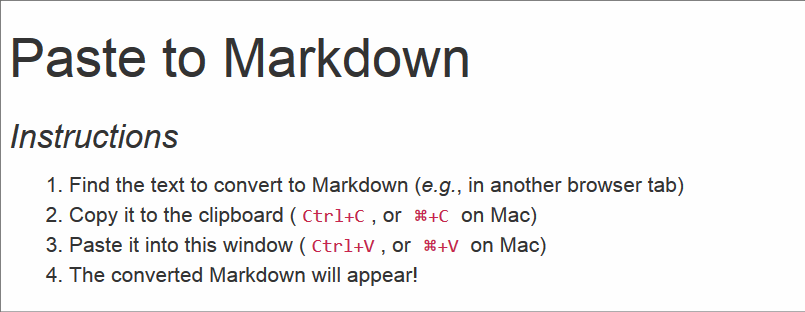

clipboard2markdown
==================

> Easily convert richly formatted text or HTML to Markdown.
> Use the clipboard and paste to Markdown with a single keypress.
>
> The conversion is carried out by
> [to-markdown](https://github.com/mixmark-io/turndown/tree/v3.1.1),
> a Markdown converter running in the browser.

Demo
----

### Interactive

<http://duyplus.github.io/paste2md/>

### Video

Usage
-----

Open [index.html](index.html) in a favorite browser and hit `Ctrl+C`
(or `⌘+C` on Mac).

To copy the converted Markdown to the clipboard, press `Ctrl+A`
followed by `Ctrl+C` (or `⌘+A` and `⌘+C` on Mac).

One can paste multiple times. This overwrites the previous conversion.

### Tested browsers

-   Edge 114 (Windows and OS X)
-   Chrome 112 (Windows and OS X)
-   Firefox 99 (Windows)
-   Safari 16 (OS X)

### License

[![License][license-image]][license-url]

Released under the MIT License. See the [LICENSE](LICENSE) file
for details.

[license-image]: https://img.shields.io/npm/l/markdownlint.svg
[license-url]: http://opensource.org/licenses/MIT
